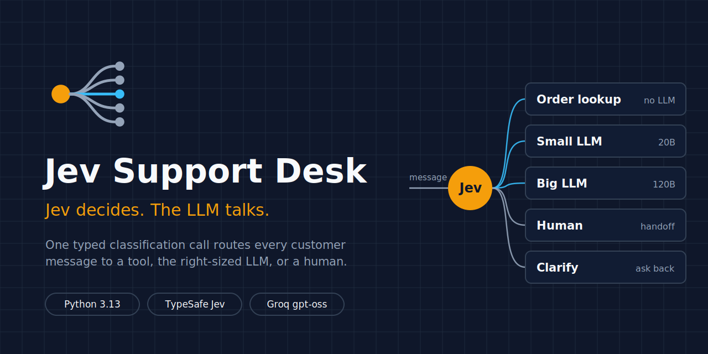
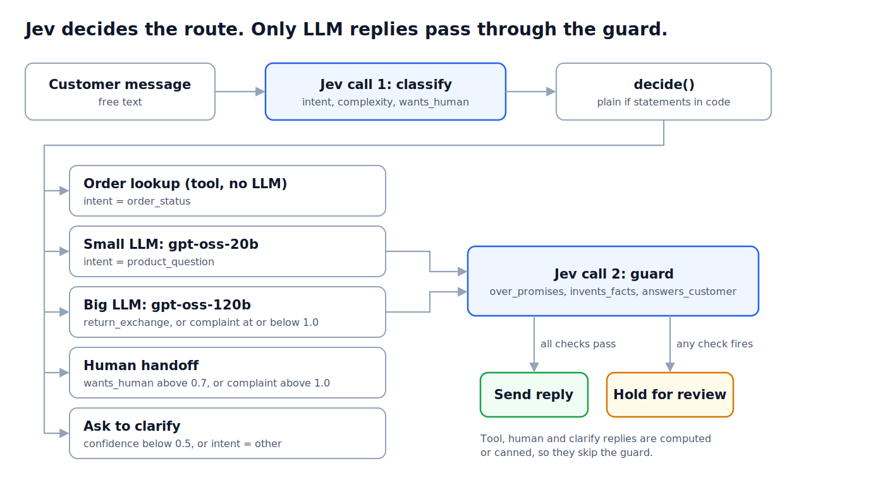

<p align="center">
  
</p>

# Jev Support Desk

A customer support desk where a decision model picks the route and an LLM only writes the reply when one is actually needed.

Every incoming message goes to Jev (TypeSafe AI's classification model) first. Jev answers three typed questions about it: what the customer wants, how messy the request is, and whether they asked for a person. A handful of plain `if` statements then send the message to one of five places. If an LLM wrote the reply, a second Jev call reads the draft and holds it when it promises something the policy doesn't allow.

The demo business is Kumkum Home, a made-up Indian home-decor store with three orders, a four-item catalog and a 7-day return policy.

> **Status:** design and documentation stage. The code has not been written yet. This repo currently holds the plan, and the folder layout below is the target.

## Why this approach

Most "LLM support bot" demos send everything to one big model and hope the prompt holds. This project splits the job:

- **Jev decides.** One call returns typed answers (a choice, a score, a probability) with a confidence that is computed from the probability spread, not a number the model typed out.
- **Code routes.** The routing policy is about ten lines of Python that anyone on the team can read and argue with. It doesn't live inside a prompt.
- **The LLM talks, but only when it has to.** Order status is a database lookup. A request for a human goes to a human. Three of the five routes never touch an LLM.
- **Jev checks the reply.** "The model follows the policy most of the time" isn't good enough for a message a customer will read.

## Architecture

<p align="center">
  
</p>

| Route | When | What answers |
| --- | --- | --- |
| `tool` | intent is `order_status` | Dictionary lookup in `store.py`, no model |
| `small_llm` | intent is `product_question` | Groq `openai/gpt-oss-20b` with the catalog only |
| `big_llm` | returns, exchanges, simpler complaints | Groq `openai/gpt-oss-120b` with the policy and computed order facts |
| `human` | `wants_human` above 0.7, or a complaint with complexity above 1.0 | Canned handoff message |
| `clarify` | intent confidence below 0.5, or intent is `other` | Canned clarifying question |

Rules are checked top to bottom and the first match wins. A request for a person beats everything, and a low-confidence guess gets a clarifying question rather than an action.

## The guard

After a small or big LLM writes a draft, one Jev call asks three yes/no questions about it:

| Check | Holds the reply when |
| --- | --- |
| `over_promises`: offers a discount, coupon, compensation or out-of-policy return | score above 0.75 |
| `invents_facts`: states a price, date, status or refund amount not in the allowed facts | score above 0.75 |
| `answers_customer`: actually responds to what was asked | score below 0.5 |

The 0.75 cutoff came from measurement, not a guess. Five versions of the same returns reply were scored: honest ones landed between 0.36 and 0.53, replies with an invented date or refund amount landed at 0.88 and 0.95. The cutoff sits in that gap.

One lesson worth keeping: Jev is weak at arithmetic and date comparison. When the order facts only said "delivered 5 days ago", Jev had to work out that 5 is less than 7 and honest replies scored near 0.5. The fix was to do the maths in code and state "inside the 7-day return window" directly.

## Planned project structure

```
jev-support-desk/
├── README.md
├── assets/
│   ├── banner.png          # README header and social preview (1280x640)
│   ├── logo.png            # square mark (512x512)
│   └── architecture.png    # flow diagram
├── .env.example            # key names, empty values
├── .gitignore              # .env, __pycache__/, .venv/
├── pyproject.toml
└── src/
    ├── config.py           # loads .env, model IDs, every routing threshold
    ├── store.py            # orders, catalog, return policy, order-ID regex, date maths (no AI)
    ├── jev_router.py       # Jev call 1 (classify) + decide()
    ├── handlers.py         # runs the chosen route, builds order facts, calls Groq
    ├── guard.py            # Jev call 2: three checks, returns send or hold
    ├── desk.py             # CLI: ask, demo, race
    └── race.py             # Jev router vs an LLM router, side by side
```

## Tech stack

- Python 3.10 or newer (built against 3.13), managed with `uv`
- `typesafe-sdk` for Jev (pinned to `jev-1.13.0`, since thresholds are tuned to one version)
- `groq` for the two LLMs
- `python-dotenv` for keys

## Setup (once the code lands)

```bash
uv init jev-support-desk --python 3.13
cd jev-support-desk
uv add typesafe-sdk groq python-dotenv
```

Create `.env`:

```bash
# TypeSafe directly
TYPESAFE_API_KEY=your-typesafe-key
GROQ_API_KEY=your-groq-key

# or through Vercel AI Gateway
# TYPESAFE_API_KEY=your-vercel-ai-gateway-key
# TYPESAFE_BASE_URL=https://ai-gateway.vercel.sh/typesafe
# TYPESAFE_DEFAULT_MODEL=typesafe-ai/jev
```

Get Jev keys only from typesafe.ai, vercel.com or openrouter.ai. There are lookalike reseller domains that charge more and proxy your traffic.

Every command runs with `PYTHONPATH=.` so `src` is importable:

```bash
PYTHONPATH=. uv run python -m src.desk ask "Where is my order KH-1042?"
PYTHONPATH=. uv run python -m src.desk demo
PYTHONPATH=. uv run python -m src.desk race
```

On Windows, write `.env` in an editor. PowerShell 5.1's `Out-File` adds a byte-order mark and the first key silently fails to load.

## Build plan

| Phase | Work | Done when |
| --- | --- | --- |
| 0 | Project setup, keys | `models.list()` prints a Jev model |
| 1 | `config.py`, `store.py` | Lookups and day counts match expected output, no keys needed |
| 2 | `jev_router.py` | Offline `decide()` tests pass; "My diyas arrived broken, I want my money back" routes to `big_llm` |
| 3 | `handlers.py` | `order_facts()` returns the three expected fact strings |
| 4 | `guard.py` | An honest refund reply sends; a "10% coupon" reply is held |
| 5 | `desk.py` | Demo routes 6 of 6 correctly, 3 of them with no LLM |
| 6 | `race.py` | Comparison table of Jev vs LLM routing |
| 7 | Hardening | pytest suite, structured logs, a 30 to 50 message eval set, timeouts with a fallback to `human` |

## Known limitations

- Single-turn only. There's no conversation history, so the clarify route can loop.
- Held replies have nowhere to go yet. A review queue is needed.
- Thresholds were tuned on five probes. That's enough for a demo, not for production.
- Each Jev call adds roughly 0.4 to 0.6 seconds, so LLM routes pay for two of them.
- Customer text reaches both the LLM and the guard, so prompt injection needs its own test cases.
- `TODAY` is fixed in `store.py` to keep the demo deterministic.

